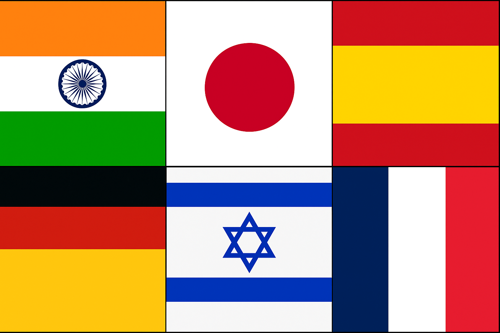

  

**அகர முதல எழுத்தெல்லாம் ஆதி பகவன் முதற்றே உலகு.**  
*"As the letter 'A' is the first of all letters, so the eternal God is first in the world." — Thirukkural 1:1*

---

## 🌍 Overview

**PolyglotAI** is an open-source initiative to build a **multimodal and multilingual Large Language Model**, starting from **Tamil** and extending to other **Indic** and **global languages**.  
It unifies **text, speech, and visual intelligence** to create a system that understands cultural nuance, linguistic diversity, and multimodal information.

Unlike generic multilingual models, **PolyglotAI** emphasizes *cultural, linguistic, and phonetic precision* — beginning with Tamil (தமிழ்) and expanding to Indian and global languages for cross-lingual understanding and digital inclusivity.

---

### 🧠 Supported Languages

| Category | Language | Script | Use Case / Purpose |
|-----------|-----------|---------|--------------------|
| 🇮🇳 **Indic Languages** | **Tamil (ta)** | தமிழ் | Core LLM training, OCR digitization, and speech interfaces |
| 🇮🇳  | **Hindi (hi)** | देवनागरी | National communication, e-governance, and education |
| 🇮🇳  | **Malayalam (ml)** | മലയാളം | Literature, media transcription, and accessibility |
| 🇮🇳  | **Kannada (kn)** | ಕನ್ನಡ | Academic, administrative, and regional dialogue |
| 🇮🇳  | **Telugu (te)** | తెలుగు | Healthcare, conversational AI, and subtitles |
| 🌏 **Global Languages** | **Japanese (ja)** | 日本語 | Technical documentation, translation, and educational use |
| 🇩🇪  | **German (de)** | Deutsch | Industrial and medical domain reasoning |
| 🇫🇷  | **French (fr)** | Français | Academic and policy communication |
| 🇪🇸  | **Spanish (es)** | Español | Cultural, conversational, and tourism-based applications |
| 🇮🇱  | **Hebrew (he)** | עברית | Jewish cultural heritage, linguistic preservation, and right-to-left language support |

---

### 🧩 Multimodal Capabilities

| Modality | Function | Description |
|-----------|-----------|-------------|
| 📝 **Text** | Tokenizer + LLM | Shared multilingual tokenizer and fine-tuned LLM with CT → SFT → DPO pipeline for fluency, translation, and politeness across languages. |
| 🔊 **Speech** | ASR + TTS | Whisper and Coqui TTS/VITS pipelines for Indic and global accents, supporting native pronunciation and cross-lingual voice interaction. |
| 🖼️ **OCR** | Image → Text | Tesseract + OpenCV with traineddata for Tamil, Devanagari, Malayalam, Kannada, Telugu, Latin, and Hebrew scripts — enabling global document understanding. |
| 📚 **RAG** | Knowledge Retrieval | FAISS + multilingual Sentence-Transformers to ground model responses with factual data from Indic and global sources. |
| ⚙️ **Serving** | API + Interface | FastAPI + vLLM backend with a Gradio UI for interactive text, speech, and image queries. |

---

### 🔍 Why This Matters

Over **7,000 spoken languages** exist globally, yet AI largely favors English and a few major languages.  
**PolyglotAI** bridges this gap, creating an ecosystem where **Indic and global languages** coexist, interact, and learn from each other.

- **Education & Accessibility:** Voice-based multilingual tutors and translation tools.  
- **Healthcare & Governance:** Real-time multilingual assistants for hospitals and citizen services.  
- **Cultural Preservation:** OCR + AI restoration of ancient scripts and literature, including Tamil, Hebrew, and Sanskrit texts.  
- **Research & Innovation:** Open datasets and fine-tuning frameworks for cross-script and cross-cultural LLMs.  
- **Global Communication:** Seamless Tamil–Japanese, Hindi–Hebrew, or Telugu–French dialogue.

---

### 🧬 Key Innovations

- **Unified Multilingual Tokenizer:** Hybrid SentencePiece vocabulary across 10+ scripts, including right-to-left (Hebrew).  
- **Cross-Lingual Pretraining:** Semantic knowledge transfer among Tamil, Hindi, Hebrew, and Japanese corpora.  
- **SFT + DPO Alignment:** Politeness and tone adapted to each language’s cultural etiquette.  
- **Multilingual ASR & TTS:** Native-sounding speech for major Indic and global languages.  
- **Multiscript OCR Pipeline:** Universal recognition for Indic, Latin, and Semitic scripts.  
- **FAISS-Based RAG:** Knowledge retrieval from multilingual corpora (Indic + Global Wikipedia + Books).  
- **FastAPI + vLLM Serving:** Optimized for scalable, low-latency inference.

---

### 🌐 Vision

To create a **cross-cultural, cross-script AI ecosystem** that:
- Understands **semantics and tone** across 10 major languages.  
- Enables **real-time translation** and **multimodal understanding** between East and West.  
- Promotes **digital equality** across linguistic borders.  
- Acts as an **AI bridge** between Indic, European, and Semitic civilizations.

---

### 🕉️ Impact

| Domain | Benefit |
|---------|----------|
| **Education** | AI tutors in Tamil, Hindi, Hebrew, and other global languages |
| **Healthcare** | Real-time speech translation for multilingual medical interactions |
| **Governance** | Citizen assistants supporting cross-language communication |
| **Culture** | Preservation and digitization of Indic, Hebrew, and global manuscripts |
| **Research** | Benchmark for multimodal, multilingual AI aligned with human culture |

---

### ✨ Summary

Together, these components form a **unified PolyglotAI Multimodal Platform** that can **read, listen, translate, and respond** across:
> **Tamil · Hindi · Malayalam · Kannada · Telugu · Japanese · German · French · Spanish · Hebrew**

**PolyglotAI** — *Bridging civilizations through multilingual, multimodal intelligence.* 🇮🇳🤝🌏🇮🇱
